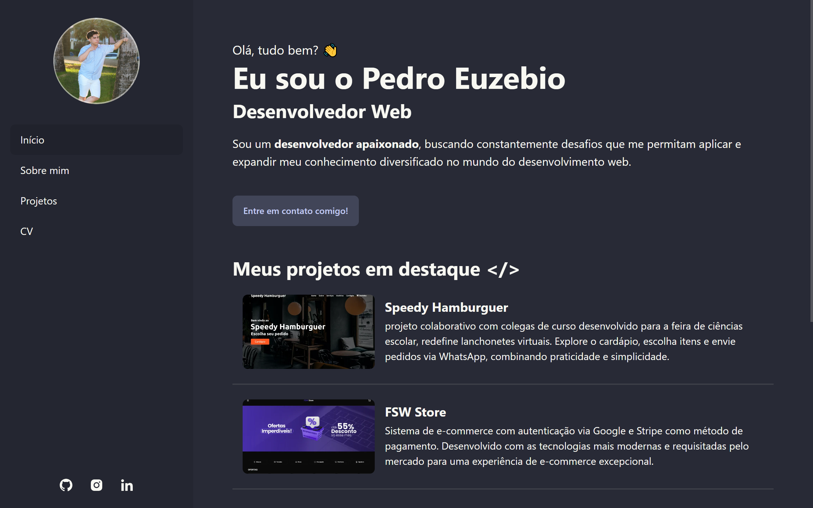

<h1 align="center">pedroeuzebio</h1>

  <a href="#tecnologias">Tecnologias</a>&nbsp;&nbsp;&nbsp;|&nbsp;&nbsp;&nbsp;
  <a href="#projeto">Projeto</a>&nbsp;&nbsp;&nbsp;|&nbsp;&nbsp;&nbsp;
  <a href="#licenca">Licença</a>

  

  

## 🛠 Tecnologias

Esse projeto foi desenvolvido com as seguintes tecnologias:

- Astro
- Tailwind
- DaisyUI

## 💻 Projeto

O pedroeuzebio é meu site pessoal/portfólio.

- [Acesse o projeto finalizado, online](https://pedroeuzebio.netlify.app/)

## 📝 Licença

Esse projeto está sob licença MIT. Veja o arquivo [LICENÇA](LICENSE.md) para mais detalhes.

---

Feito com ♥ by Pedro Euzebio